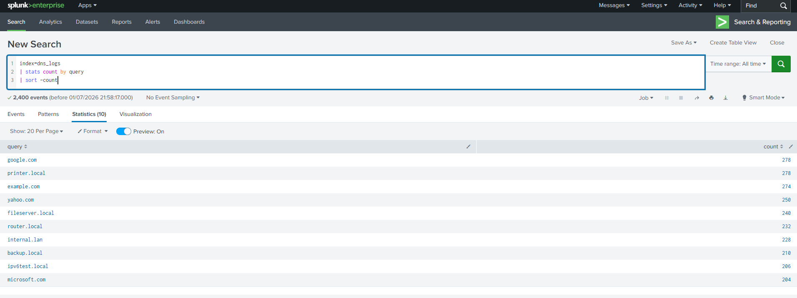
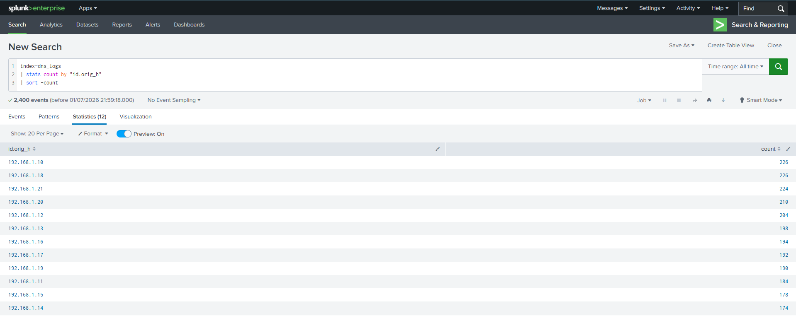

# 🧪 Lab Title: Splunk SIEM – DNS Log Analysis

---

# 🎯 Objective

In this lab, you will:

- Learn how to ingest and analyze DNS logs using Splunk Enterprise.
- Perform DNS log analysis using SPL (Search Processing Language).
- Investigate DNS traffic patterns, client activity, DNS servers, and response codes.
- Build a SOC-style dashboard for security monitoring.

---

# 🖥️ Lab Setup

- ✅ Splunk
- ✅ JSON-formatted Zeek DNS Logs
- ✅ 🌐 Log File: Download the file below and place it in a directory accessible to Splunk for ingestion.

📥 **[Download sample dns file](https://github.com/gyanesh-chand/splunk-dns-log-analysis/blob/main/dns_logs.json)**

---

# ⚙️ Data Ingestion

1. Open **Splunk Enterprise**
2. Navigate to **Settings → Add Data**
[](screenshots/Add_data.png)
3. Select **Upload**
4. Upload `dns_logs.json`
5. Source Type: `_json`
6. Create an index named **dns_logs**
7. Finish the upload and verify successful indexing.
[](screenshots/Upload_Completed.png)
---

# 🔍 Investigation Tasks

---

# ✅ Task 1 — Total DNS Events
### SPL Query
```spl
index=dns_logs
| stats count AS "Total DNS Events"
```
### Purpose
Determine the total number of DNS events ingested into Splunk.
[](screenshots/01.png)
---

# ✅ Task 2 — Top Queried Domains
### SPL Query
```spl
index=dns_logs
| stats count by query
| sort -count
| head 10
```
### Purpose
Identify the domains that generated the highest number of DNS requests.
[](screenshots/2.png)
---

# ✅ Task 3 — Top Source Clients
### SPL Query
```spl
index=dns_logs
| stats count by "id.orig_h"
| sort -count
| head 10
```
### Purpose
Identify the client IP addresses generating the highest DNS traffic.
[](screenshots/3.png)
---

# ✅ Task 4 — Top DNS Servers

### SPL Query

```spl
index=dns_logs
| stats count by "id.resp_h"
| sort -count
```

### Purpose

Identify the DNS servers handling client requests.

### Screenshot

<p align="center">
  <a href="screenshots/06_top_dns_servers.png">
    
  </a>
</p>

---

# ✅ Task 5 — DNS Query Type Distribution

### SPL Query

```spl
index=dns_logs
| stats count by qtype
```

### Purpose

Analyze the distribution of DNS query types such as A, AAAA, PTR and CNAME.

### Screenshot

<p align="center">
  <a href="screenshots/07_dns_query_types.png">
    
  </a>
</p>

---

# ✅ Task 6 — DNS Response Codes

### SPL Query

```spl
index=dns_logs
| stats count by rcode
```

### Purpose

Analyze DNS response codes to determine successful and failed lookups.

### Screenshot

<p align="center">
  <a href="screenshots/08_dns_response_codes.png">
    
  </a>
</p>

---

# ✅ Task 7 — Most Returned IP Addresses

### SPL Query

```spl
index=dns_logs
| stats count by answers
| sort -count
| head 10
```

### Purpose

Identify the IP addresses most frequently returned in DNS responses.

### Screenshot

<p align="center">
  <a href="screenshots/09_returned_ip_addresses.png">
    
  </a>
</p>

---

# ✅ Task 8 — Protocol Distribution (UDP vs TCP)

### SPL Query

```spl
index=dns_logs
| stats count by proto
```

### Purpose

Determine which transport protocol was used for DNS communication.

### Screenshot

<p align="center">
  <a href="screenshots/10_protocol_distribution.png">
    
  </a>
</p>

---

# ✅ Task 9 — DNS Activity Over Time

### SPL Query

```spl
index=dns_logs
| timechart span=1h count
```

### Purpose

Visualize DNS traffic trends over time.

### Screenshot

<p align="center">
  <a href="screenshots/11_dns_activity_over_time.png">
    
  </a>
</p>

---

# 📊 Final Dashboard

<p align="center">
  <a href="screenshots/12_dashboard_overview.png">
    
  </a>
</p>

---

# 🛠️ Skills Demonstrated

- Splunk Enterprise
- SIEM Fundamentals
- Search Processing Language (SPL)
- DNS Log Analysis
- Security Log Analysis
- Security Monitoring
- Network Traffic Analysis
- Dashboard Development
- Data Visualization
- Zeek Log Analysis

---

# 📌 Key Learning Outcomes

- Successfully ingested JSON-formatted Zeek DNS logs into Splunk Enterprise.
- Developed SPL queries to investigate DNS traffic and client behavior.
- Built an interactive dashboard for DNS monitoring and analysis.
- Performed basic security log analysis using a SIEM platform.
- Strengthened practical knowledge of DNS traffic analysis and Splunk dashboards.

