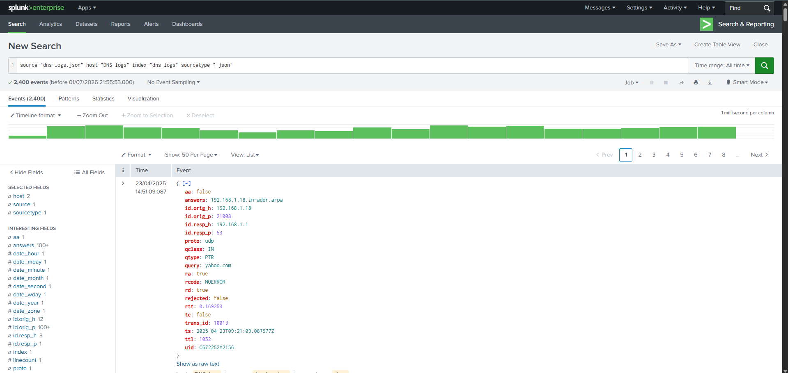
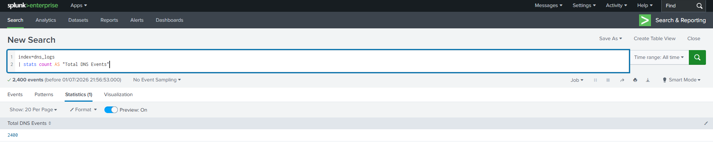

# 🧪 Lab Title: Splunk SIEM – DNS Log Analysis

---

# 🎯 Objective

In this lab, you will:

- Learn how to ingest and analyze DNS logs using Splunk Enterprise.
- Perform DNS log analysis using SPL (Search Processing Language).
- Investigate DNS traffic patterns, client activity, DNS servers, and response codes.
- Build a SOC-style dashboard for security monitoring.

---

# 🖥️ Lab Setup

- ✅ Splunk
- ✅ JSON-formatted Zeek DNS Logs
- ✅ 🌐 Log File: Download the file below and place it in a directory accessible to Splunk for ingestion.

📥 **[Download sample dns file](https://github.com/gyanesh-chand/splunk-dns-log-analysis/blob/main/dns_logs.json)**

---

# ⚙️ Data Ingestion

1. Open **Splunk Enterprise**
2. Navigate to **Settings → Add Data**
[](screenshots/Add_data.png)
3. Select **Upload**
4. Upload `dns_logs.json`
5. Source Type: `_json`
6. Create an index named **dns_logs**
7. Finish the upload and verify successful indexing.
[](screenshots/Upload_Completed.png)
---

# 🔍 Investigation Tasks

# ✅ Task 1 — Total DNS Events
### SPL Query
```spl
index=dns_logs
| stats count AS "Total DNS Events"
```
### Purpose
Determine the total number of DNS events ingested into Splunk.
### Screenshot
[]
---

