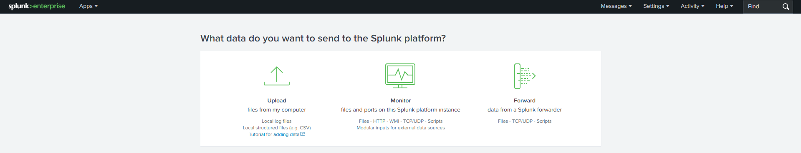

# 🧪 Lab Title: Splunk SIEM – DNS Log Analysis

---

# 🎯 Objective

In this lab, you will:

- Learn how to ingest and analyze DNS logs using Splunk Enterprise.
- Perform DNS log analysis using SPL (Search Processing Language).
- Investigate DNS traffic patterns, client activity, DNS servers, and response codes.
- Build a SOC-style dashboard for security monitoring.

---

# 🖥️ Lab Setup

- ✅ Splunk
- ✅ JSON-formatted Zeek DNS Logs
- ✅ 🌐 Log File: Download the file below and place it in a directory accessible to Splunk for ingestion.

📥 **[Download sample dns file](https://github.com/gyanesh-chand/splunk-dns-log-analysis/blob/main/dns_logs.json)**

---

# ⚙️ Data Ingestion

1. Open **Splunk Enterprise**
2. Navigate to **Settings → Add Data**
3. 
4. Select **Upload**
5. Upload `dns_logs.json`
6. Source Type: `_json`
7. Create an index named **dns_logs**
8. Finish the upload and verify successful indexing.

---
